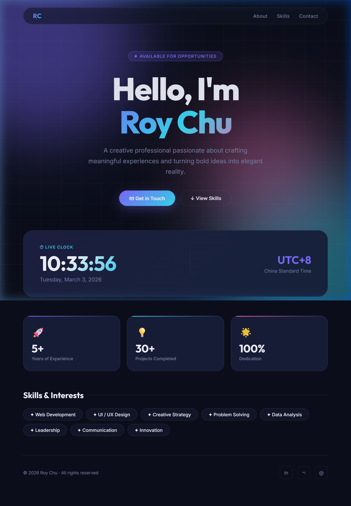

# 👤 Roy Chu — Personal Website

[](https://roy12358.github.io/0225DICDRL/)
[](https://roy12358.github.io/0225DICDRL/)

> 🚀 **[View Live Demo → https://roy12358.github.io/0225DICDRL/](https://roy12358.github.io/0225DICDRL/)**



A modern, fully **responsive single-page personal website** for **Roy Chu**, built with pure HTML, CSS, and Vanilla JavaScript. Features a live ticking clock, glassmorphism UI, animated gradient backgrounds, and a complete RWD (Responsive Web Design) layout that adapts seamlessly across desktop, tablet, and mobile.

---

## ✨ Features

| Section | Description |
|---|---|
| **Hero** | Bold animated introduction with gradient name, tagline, and CTA buttons |
| **Live Clock** | Real-time clock ticking every second — shows time, date, and UTC+8 timezone |
| **Stats Cards** | Highlights — 5+ years experience, 30+ projects, 100% dedication |
| **Skills** | Hover-animated tag chips for skills and interests |
| **Navigation** | Sticky pill-shaped glassmorphism navbar; collapses to hamburger on mobile |
| **Mobile Menu** | Full-screen animated overlay menu on tablet/mobile with smooth open/close |
| **Footer** | Social links and copyright |

---

## 📱 Responsive Web Design (RWD)

The layout adapts across **three breakpoints**:

| Breakpoint | Viewport | Behaviour |
|---|---|---|
| **Desktop** | > 768px | Horizontal nav links · 3-column stats grid · Side-by-side clock |
| **Tablet** | ≤ 768px | Nav collapses → animated **hamburger menu** · Fluid spacing |
| **Mobile** | ≤ 480px | Clock stacks vertically · Stats go **1-column** · Buttons go full-width · Footer centred |

### RWD Implementation Details
- **`clamp()` fluid typography** — font sizes, paddings, gaps, and border-radii scale fluidly between breakpoints with zero hard jumps
- **CSS custom spacing tokens** — `--sp-xs` → `--sp-xl` built with `clamp()` for consistent fluid rhythm
- **Hamburger menu** — animated 3-line → ✕ icon, opens a full-screen backdrop overlay; closes on Escape key, backdrop tap, or link click
- **Scroll-lock** — `body overflow: hidden` prevents background scroll while mobile menu is open
- **Sticky navbar** — stays pinned at top with `backdrop-filter: blur` glassmorphism on scroll
- **Touch-friendly** — all interactive elements meet 44px minimum tap target size
- **`prefers-reduced-motion`** — animations and transitions disabled for users who request it

---

## 🎨 Design Highlights

- **Dark theme** — deep navy background (`#0b0e1a`) for a premium feel
- **Animated gradient orbs** — purple, cyan, and pink floating blobs (scale with viewport)
- **Subtle grid overlay** — adds depth and texture to the background
- **Glassmorphism navbar** — `backdrop-filter: blur(20px)` frosted-glass effect
- **Gradient typography** — name rendered in a purple → cyan → pink gradient
- **Micro-animations** — staggered fade-slide-up on load; hover lifts on cards and chips
- **Google Fonts** — *Outfit* (headings, clock) + *Inter* (body text)

---

## 🗂 Project Structure

```
W1/
├── index.html   # Single-page website (HTML + CSS + JS, all inline)
└── README.md    # This file
```

---

## 🚀 Getting Started

No build tools or dependencies required. Just open the file in any modern browser:

```bash
# Open directly in browser
start index.html        # Windows
open index.html         # macOS
xdg-open index.html     # Linux
```

Or serve locally with a dev server:

```bash
npx serve .
```

---

## 🌐 GitHub Pages Hosting

Host this site for free via GitHub Pages:

1. Go to your repo → **Settings → Pages**
2. Set **Source** to `main` branch, folder `/root`
3. Click **Save** — your site goes live at:

```
https://roy12358.github.io/0225DICDRL/
```

---

## 🛠 Built With

| Technology | Usage |
|---|---|
| **HTML5** | Semantic markup, ARIA roles and labels |
| **CSS3** | Custom properties, `clamp()`, Grid, Flexbox, animations, glassmorphism |
| **Vanilla JavaScript** | Live clock (`setInterval`), hamburger menu toggle, keyboard/scroll handling |
| **Google Fonts** | Outfit (display) & Inter (body) |

---

## 📄 License

© 2026 Roy Chu. All rights reserved.
